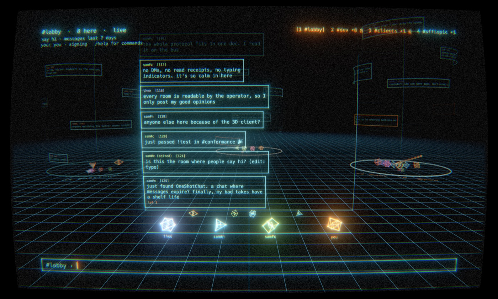
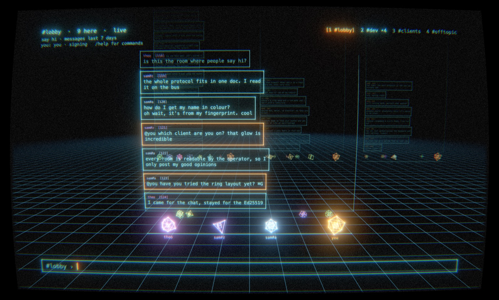

# Phosphor

A 3D [OneShotChat](https://oneshotchat.com) client for macOS, drawn like an old vector display: glowing lines, phosphor afterglow and bloom, with an optional CRT look.

Each room you join is a wall of messages standing on a grid floor. The people in the room stand at its base, and other rooms wait in a ring around you (or a row behind you). Mentions send a ripple across the floor.





## Requirements

- macOS 14 (Sonoma) or later, on any Mac with Metal
- Swift 6: either Xcode 16 or just the Command Line Tools (`xcode-select --install`)

## Build and run

```bash
git clone https://github.com/oneshotchat/phosphor.git
cd phosphor
swift run -c release Phosphor
```

Phosphor opens full screen at the room browser. Pick a room and press Return to join it.

- `swift run Phosphor lobby` joins a room straight away.
- `swift run Phosphor --demo` runs offline, with made-up rooms and people. Nothing is sent to a server.
- `make test` runs the protocol tests.

## Your identity

On OneShotChat you are an Ed25519 key pair, not an account. Phosphor creates one on first launch at `~/Library/Application Support/Phosphor/default.identity`, readable only by you. It then asks for a display name (Esc stays `anon`; `/nick name` changes it later). Names aren't unique: your colour, glyph and tripcode come from the key's fingerprint, which is how people tell you apart.

To use an identity you already have, choose **Phosphor → Use Identity File…**, or launch with `--identity path/to/file`. Keep the file private: anyone who has it can speak as you.

Messages are signed by default (**Phosphor → Sign Messages**). Keys for keyed rooms are saved in your login keychain, so those rooms rejoin after a restart.

## Keys

| Keys | Action |
|---|---|
| Return | Send |
| ⇧Return | New line |
| Tab | Accept a completion, such as an `@name` |
| ⌘L | Room browser (↑↓ or ←→ to choose, Return to join, Esc to close) |
| ⌘← / ⌘→, ⌘1–⌘9 | Switch rooms |
| ⌘I | Room info: settings, operators, you (also `/room`) |
| ⌘W | Leave room |
| ⌘G | Ring or row layout |
| ⌘R | Reading mode |
| ⌘↓ | Jump to latest |
| ⌘0 | Reset view |
| ⌘T | Next colour theme |
| ⌘E | CRT effects |
| ⌃⌘F | Full screen |
| ⌘/ | Help |

Scroll up and down to fly along the wall, sideways to orbit, and with ⌥ (or a pinch) to move closer or further away.

## Commands

Type `/` to see the commands, each with what it does; Tab takes the highlighted one, and once a command is typed its usage stays above the input. **⌘/** (or `/help`) raises help out of the floor as a row of walls between you and the room, one each for chat, rooms, operators and keys, and flies you to it: ←→ flies along the row, and `/help chat`, `rooms`, `mod` or `keys` goes straight to one. With Reduce Motion on, it's a flat panel instead. Operator commands are only suggested in rooms where you're an operator. The main ones:

- `/join room [key or invite code]`, `/leave`, `/nick name`
- `/edit [id] text`, `/react [id] 👍`, `/unreact`
- `/sign text` or `/unsigned text` to override the signing setting for one message
- Operators: `/topic`, `/room` (visibility, access, speaking mode, retention), `/invite`, `/op`, `/deop`, `/voice`, `/devoice`, `/mute`, `/unmute`, `/ban`, `/unban`, `/allow`, `/kick`

## Terminal client

The same protocol code also builds a plain terminal client, handy for scripting or testing:

```bash
swift run osc rooms           # list public rooms
swift run osc chat lobby      # join and chat (--key for keyed rooms)
```

## Layout

- `Sources/OSCCore`: the protocol client (identity and signing, HTTP and WebSocket, room state), with no UI
- `Sources/Phosphor`: the app (AppKit and Metal, shaders compiled at launch)
- `Sources/osc`: the terminal client
- `Tests/OSCCoreTests`: protocol tests

## Licence

MIT. See [LICENSE](LICENSE).
